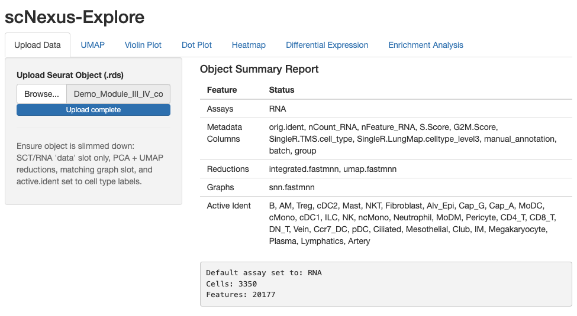

# Module III — scNexus-Explore

Explore and visualize an annotated object. Unlike the earlier modules this is
not a linear pipeline — once data is uploaded, all visualization tabs are
available in any order.

**Tabs:** Upload → UMAP Cell-Type → Violin → Dot Plot → Heatmap → Differential Expression → Enrichment

| | |
|---|---|
| **Input** | Annotated Seurat `.rds` (Module II output). For testing, use `Demo_Module_III_control_vs_disease.rds`  |
| **Output** | Figures and tables (downloadable per tab) |

> Every visualization tab downloads its figure with adjustable width and height. The Enrichment tab consumes the
> DE tab's result, so run **Differential Expression** before **Enrichment**.

---

## Step 1 — Upload Data

Load the object and confirm it is in the expected shape.

1. Open the **Upload Data** tab.
2. Load an annotated `.rds` — the object [Module II](module-II.md) produced,
   saved into `datasets/`.
3. Check the structure summary — cell counts, metadata columns, and assays.

> 📷 **Screenshot:** _Upload tab with object summary_ — `img/module-III/01-upload.png`

**Result:** the seurat object is validated and shared with every visualization tab.

---

## Step 2 — UMAP

Color the UMAP by cell type and inspect gene expression.

1. Open the **UMAP** tab
2. In **Interactive Selection**, all cells or selected cells (box or lasso selection) with the newly generated UMAP coordinates will be used in **Highlight View** and **Gene Expression** subtabs.
3. In **Highlighted View**, cell type(s) selected are colored and rest of them are in light grey. The UMAP can be splited by `None`, `orig.ident`(sample ID), `batch`, and `group`. The **Grid Columns** can be adjusted for multi-panel figure genaration.
4. **Gene Expression** contains indivisual gene **Expression** and **Co-expression** of two genes. Both of them can be splited by `None`, `orig.ident`(sample ID), `batch`, and `group`. 

> 📷 **Screenshot:** _UMAP colored by cell type_ — `img/module-III/02-umap.png`

**Result:** an interactive, downloadable UMAP.

---

## Step 3 — Violin Plot

Expression distributions by cell type.

1. Open the **Violin Plot** tab.
2. Enter the gene(s) to plot.
3. Optionally stack genes and/or split by a metadata column (`split.by`).

> 📷 **Screenshot:** _Violin plot for selected genes_ — `img/module-III/03-violin.png`

**Result:** a violin figure, downloadable.

---

## Step 4 — Dot Plot

Expression summarized across identities.

1. Open the **Dot Plot** tab.
2. Enter a gene set.
3. Optionally split by a metadata column (color scales per identity when split).

> 📷 **Screenshot:** _Dot plot for a marker gene set_ — `img/module-III/04-dot.png`

**Result:** a dot plot, downloadable.

---

## Step 5 — Heatmap

Scaled expression across cells or groups.

1. Open the **Heatmap** tab.
2. Use highly variable genes or paste a custom gene list.
3. Optionally set variables to regress out (`vars.to.regress`).

> 📷 **Screenshot:** _Heatmap of scaled expression_ — `img/module-III/05-heatmap.png`

**Result:** a scaled-expression heatmap, downloadable.

---

## Step 6 — Differential Expression

Compare two cell populations.

1. Open the **Differential Expression** tab.
2. Define the two populations to compare, with optional metadata subsetting.
3. Run DE.

> 📷 **Screenshot:** _DE results table_ — `img/module-III/06-de.png`

**Result:** a ranked DE table — and the input for the Enrichment tab.

---

## Step 7 — Enrichment

Pathway analysis on the DE result.

1. Open the **Enrichment** tab (it uses the DE result from Step 6).
2. Choose the enrichR gene-set libraries.
3. Run enrichment.

> 📷 **Screenshot:** _Enrichment bar plot_ — `img/module-III/07-enrichment.png`

**Result:** an enriched-pathway bar plot, downloadable.
