# Module III — scNexus-Explore

Explore and visualize an annotated object. Unlike the earlier modules this is
not a linear pipeline — once data is uploaded, all visualization tabs are
available in any order.

**Tabs:** Upload → UMAP Cell-Type → Violin → Dot Plot → Heatmap → Differential Expression → Enrichment

| | |
|---|---|
| **Input** | Annotated Seurat `.rds` (Module II output). For testing, use `Demo_Module_III_IV_(control_vs_disease).rds`  |
| **Output** | Figures and tables (downloadable per tab) |

> Every visualization tab downloads its figure with adjustable width and height. The Enrichment tab consumes the
> DE tab's result, so run **Differential Expression** before **Enrichment**.

---

## Step 1 — Upload Data

Load the object and confirm it is in the expected shape.

1. Open the **Upload Data** tab.
2. Load an annotated `.rds` — the object [Module II](module-II.md) produced. 
3. Check the structure summary — cell counts, metadata columns, and assays.

> 📷 **Screenshot:**
> 

**Result:** the seurat object is validated and shared with every visualization tab.

---

## Step 2 — UMAP

Color the UMAP by cell type and inspect gene expression.

1. Open the **UMAP** tab
2. **Interactive Selection**:
- **All cells**: click **Reset Everything** to witch back from selected cell view to all cell view.

> 📷 **Screenshot:**
> 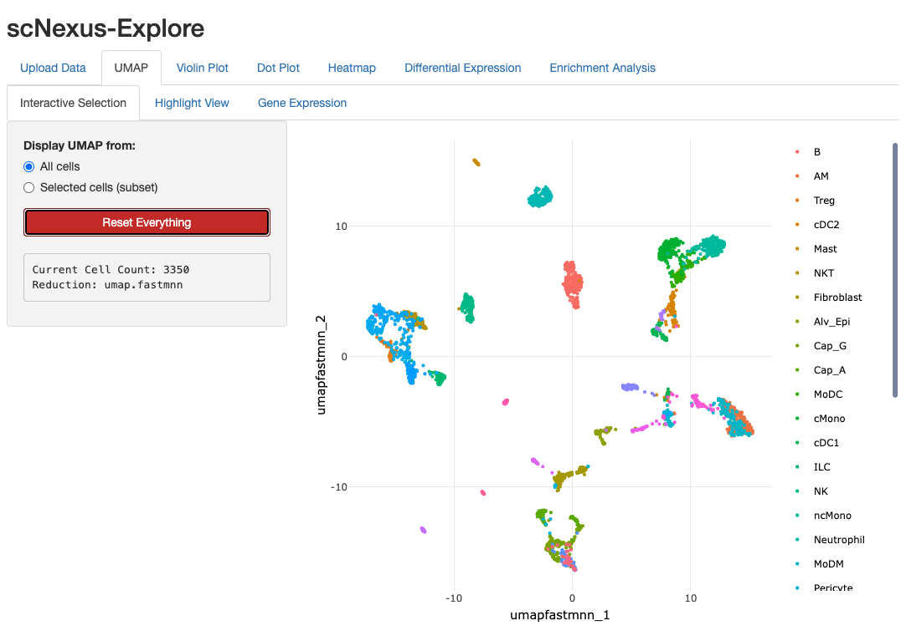

- **Selected cells (subset)**:  subset cells by box or lasso selection and new UMAP coordinates
The selection will be used in **Highlight View** and **Gene Expression**.

> 📷 **Screenshot:**
> 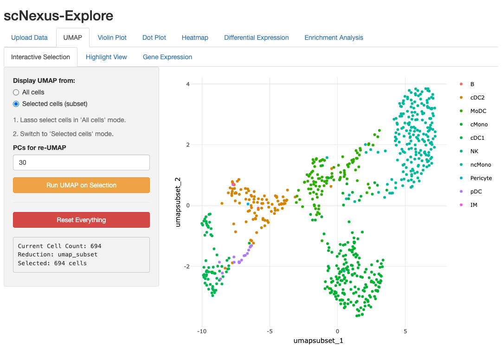

3. **Highlighted View**: 
- **Selected Cell Types(s) to Highlight**: cell type(s) selected are colored and rest of them are in light grey.

> 📷 **Screenshot:**
> 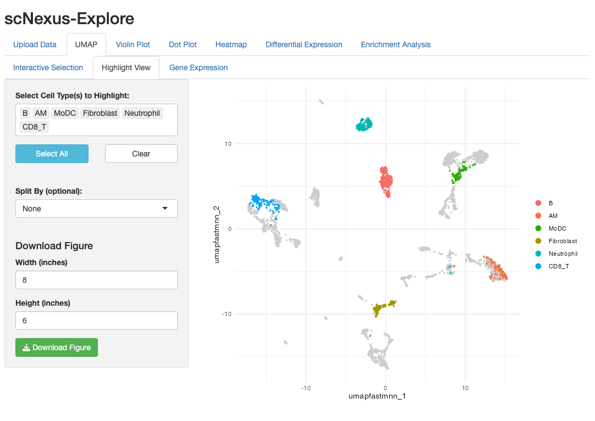

- **Split By(optionall)**: the UMAP can be splited by `None`, `orig.ident`(sample ID), `batch`, and `group`.
- **Grid Columns**: adjust the number for multi-panel figure genaration.

> 📷 **Screenshot:**
> 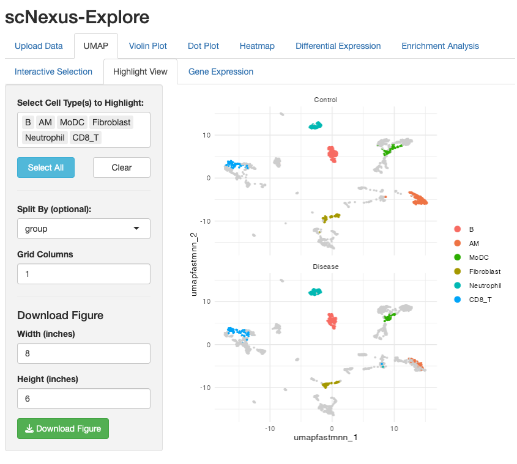

4. **Gene Expression** 
- **Expression**: individual gene expression in UMAP (splited by `None`, `orig.ident`(sample ID), `batch`, and `group`) 

> 📷 **Screenshot:**
> 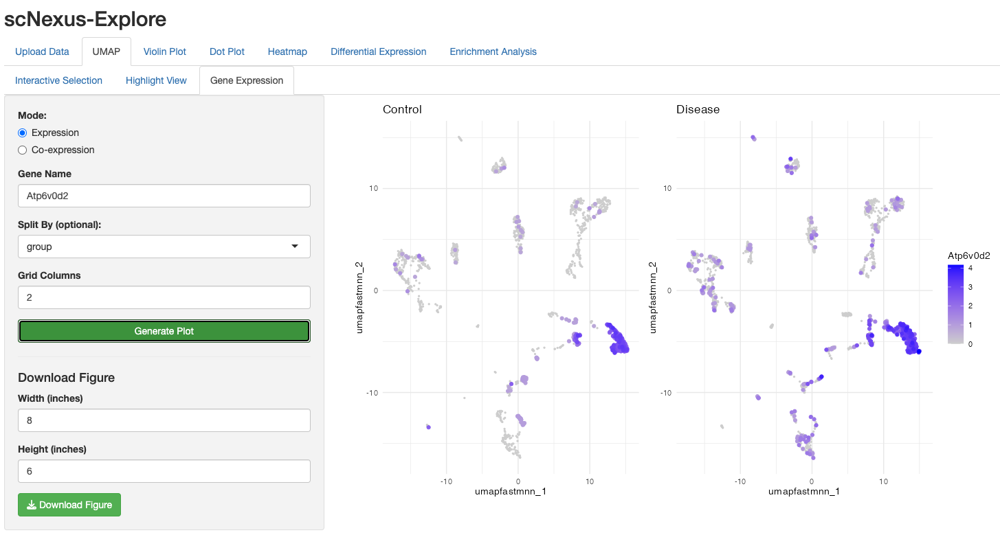

- **Co-expression**:  co-expression of two genes in UAMP (splited by `None`, `orig.ident`(sample ID), `batch`, and `group`) 

> 📷 **Screenshot:**
> 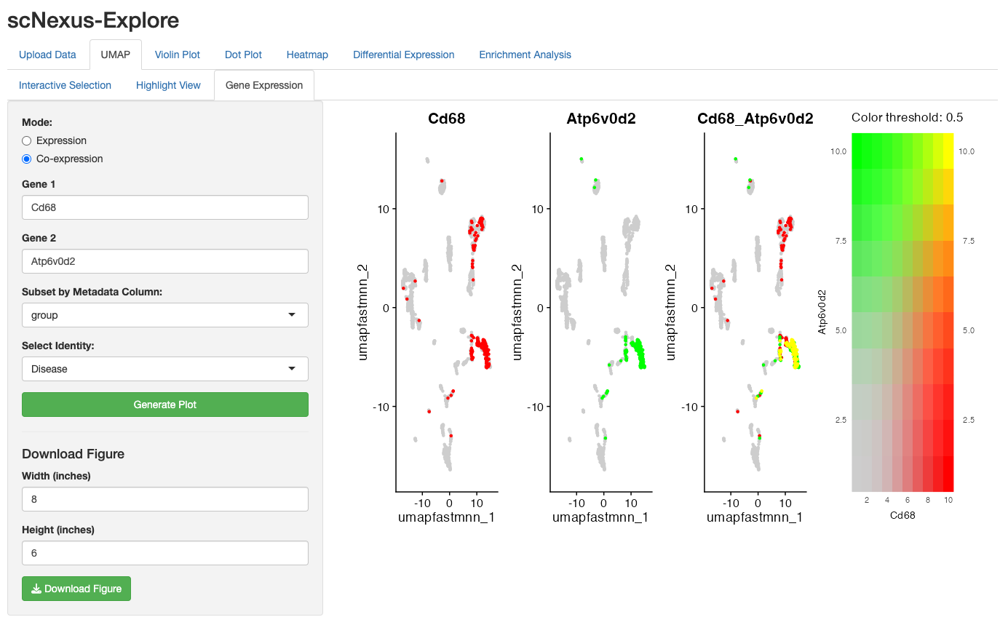

**Result:** an interactive, downloadable UMAP showing cell types, conditons, and gene (co-)expressions.

---

## Step 3 — Violin Plot

Expression distributions by cell type.

1. Open the **Violin Plot** tab.
2. Select **Cell Type(s)**.
3. Enter the **Gene(s)**.
4. Optionally check **Flip Axes** to switch the cell-type identity and gene expression level on axises.

> 📷 **Screenshot:**
> 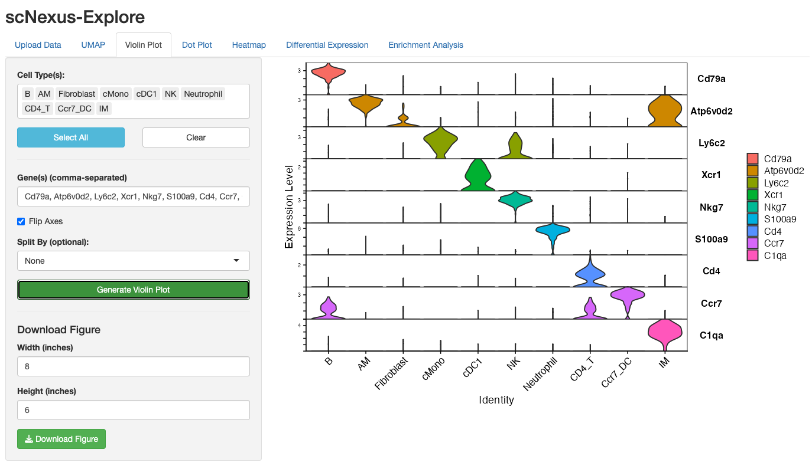

5. Optionally **Split By** `None`, `orig.ident`, `batch`, `group`.

> 📷 **Screenshot:**
> 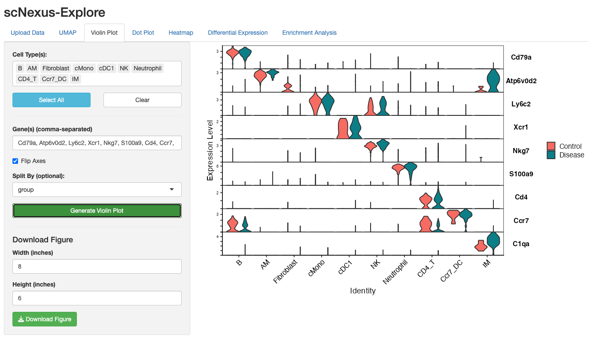

**Result:** a violin figure, downloadable.

---

## Step 4 — Dot Plot

Expression summarized across identities.

1. Open the **Dot Plot** tab.
2. Select **Cell Type(s)**.
3. Enter the **Gene(s)**.

> 📷 **Screenshot:**
> 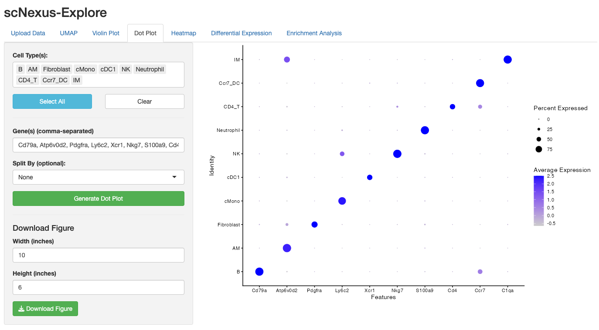

4. Optionally **Split By** `None`, `orig.ident`, `batch`, `group`.

> 📷 **Screenshot:**
> 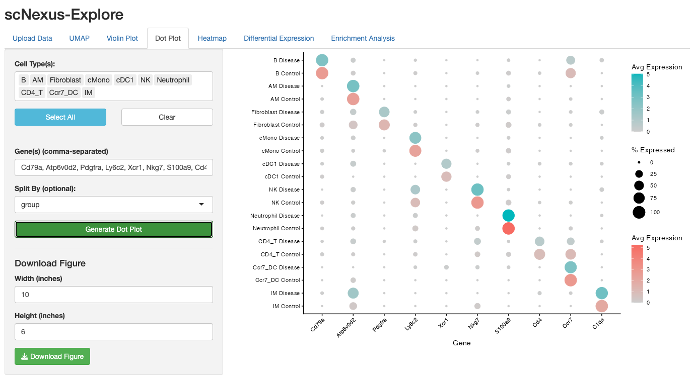

**Result:** a dot plot, downloadable.

---

## Step 5 — Heatmap

Scaled expression across cells or groups.

1. Open the **Heatmap** tab.
2. Select **Cell Type(s)**.
3. Select from **Metadata Column** and **Select Value(s)**. 
4. **Gene Selction**
- Select *Highly Variable Genes* and enter **Top N variable Genes**.
- Select *Custom Gene List* and enter gene list in **Gene(s) (comma-separated)**.
5. Optionally set variables to regress out (`vars.to.regress`).
6. Determine **Max cells in Heatmap**.

> 📷 **Screenshot:**
> 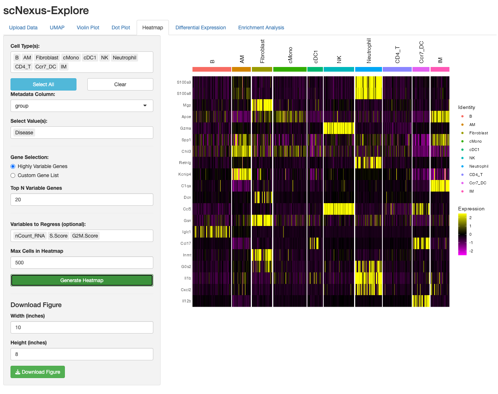

**Result:** a scaled-expression heatmap, downloadable.

---

## Step 6 — Differential Expression

Compare two cell populations.

1. Open the **Differential Expression** tab.
2. Use **Cell Type(s)**, **Metadata Column** (`None`, `orig.ident`(sampleID), `batch`, `group`) to define **Target Group (ident.1)** and **Baseline Group (ident.2)** for two populations comparision:
- Same population(s) different from different samples or conditions
- Different population(s) from the same sample or condition
- Different population(s) from different samples or conditions
3. **Run DE Analysis**.
4. The result (filtered by p_val_adj <0.05) is showed in interactive table.

> 📷 **Screenshot:**
> 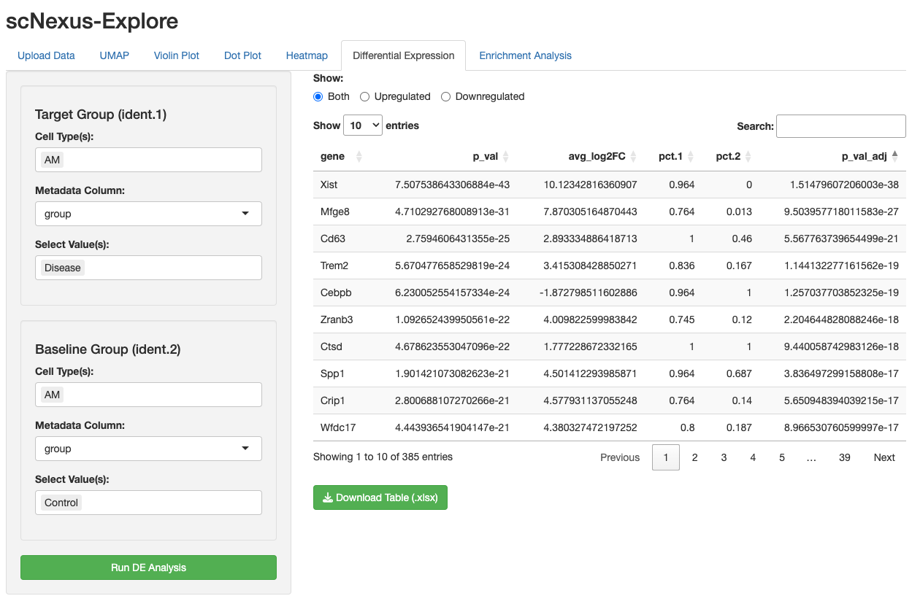

**Result:** a ranked DE table — and the input for the Enrichment tab.

---

## Step 7 — Enrichment

Pathway analysis on the DE result (from Step 6).

**Enrichment Table** 
1. Choose the one of the seven **EnrichR Databases**
2. **Run Enrichment Analysis**.
3. The result (filtered by P.value <0.05) is showed in interactive table.
   
> 📷 **Screenshot:**
> 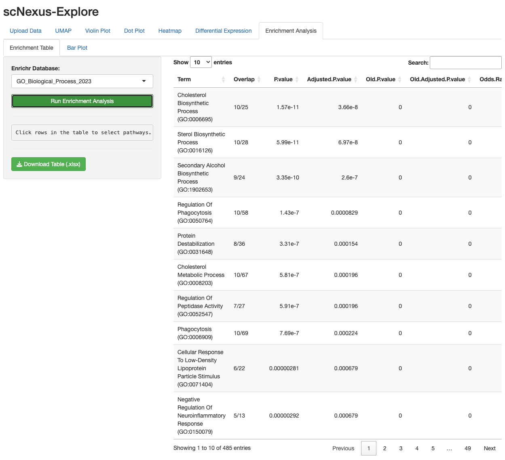

**Bar Plot**
1. **Pathways to Plot**: has the *Top 10* pathways or pathways in *Selected Rows* from the enrichment table.
2. Select different color to scale the `Odds.Ratio`
3. Click **Generate Bar Plot**

> 📷 **Screenshot:**
> 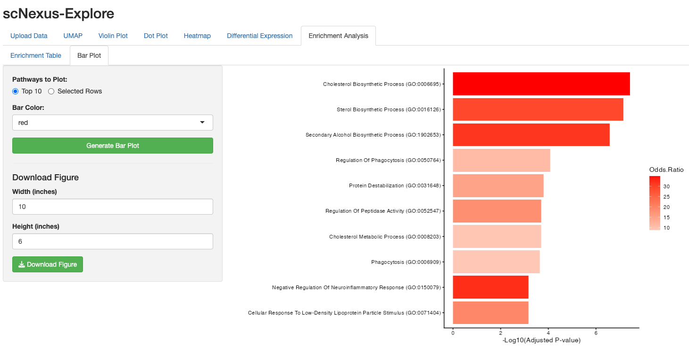

**Result:** an enriched-pathway table and bar plot, downloadable.
