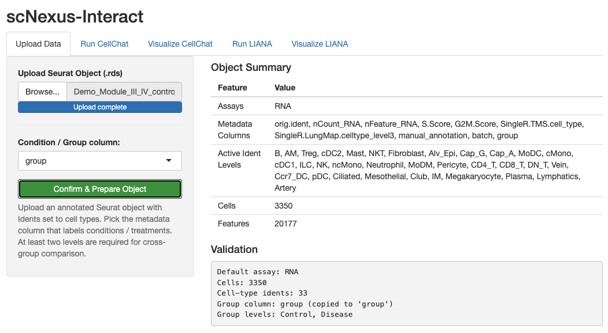
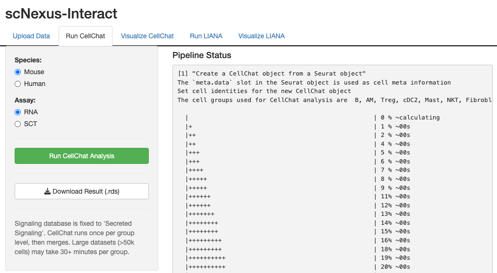
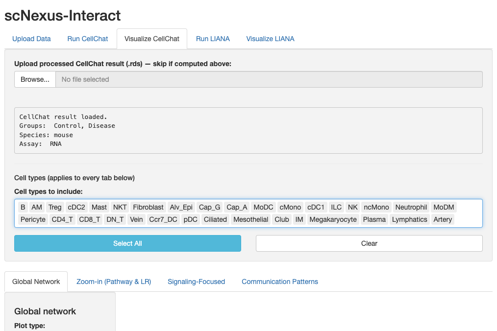
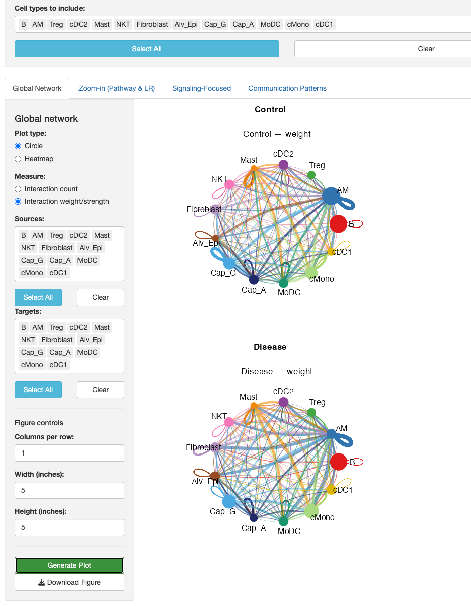
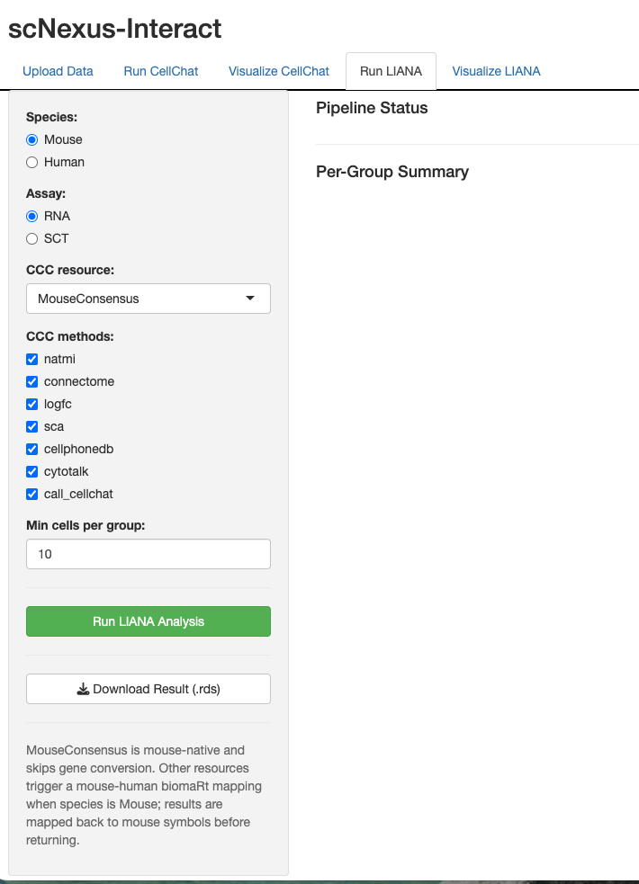

# Module IV — scNexus-Interact

Infer cell-cell communication with two parallel engines — **CellChat** and
**LIANA** — over a single shared upload. Run either or both.

**Tabs:** Upload → Run CellChat → Visualize CellChat → Run LIANA → Visualize LIANA

| | |
|---|---|
| **Input** | Annotated Seurat `.rds` (Module II output). For testing, use `Demo_Module_III_IV_(control_vs_disease).rds` |
| **Output** | CellChat or LIANA result object (`.rds`) and figures and tables |

> The single upload feeds all four downstream tabs. Every visualization panel is
> gated behind a **Generate Plot** button, so tweaking parameters queues up
> without triggering an expensive re-render until you ask for it.

---

## Step 1 — Upload

Load the object and choose the grouping used for cell-cell communication.

1. Open the **Upload** tab.
2. Click **Brower...** to load an annotated `.rds` — the object [Module II](module-II.md) produced.
3. Pick the metadata column to use as **Condition / Group column** (`group`).
4. Click **Confirm & Prepare Object** and alidate the information in the *Validation* tex box.

> 📷 **Screenshot:** 
> 

**Result:** a validated, grouped object shared with all four downstream tabs.

---

## Step 2 — Run CellChat

Compute cell-cell communication with CellChat v2. 

1. Open the **Run CellChat** tab.
2. Select **Species**.
3. Select **Assay** for data input.
4. **Run CellChat Analysis** — CellChat is computed per group/conditon on the Secreted Signaling
   database, then merged across groups/conditions for cross-group comparison.
5. **Download Result(`.rds`)** for the next step.

> 📷 **Screenshot:** 
> 

**Result:** a CellChat result object, downloadable as `.rds`. (This step is
computationally intensive. Running this step on a server or high-performance computing (HPC) environment is recommended for large datasets.)

---

## Step 3 — Visualize CellChat

Defind cell types for Analysis and visualization

1. **Upload processed CellChat result (`.rds`) - skip if computed above**
2. Select from **Cell types to include**

> 📷 **Screenshot:**
> 

Explore the CellChat result across four subtabs.

1. **Global Network** — overall interaction counts / strengths between groups.
2. **Zoom-in** — a chosen signaling pathway or ligand-receptor pair.
3. **Signaling-Focused** — outgoing/incoming signaling roles per group.
4. **Communication Patterns** — including the manifold-learning embedding.

Figure Control
1. **Columns per row**: arrange for multiple panels
2. **Width (inches)** and **Height (inches)**: for each panel
3. **Generate Plot**: visualize the output
4. **Download Figure**: apply **Columns per row**, **Width (inches)**, and **Height (inches)**

> 📷 **Screenshot:**
> 

**Result:** downloadable figures for each selected view. More information about CellChat v2 and example figures can be found at [https://github.com/sqjin/CellChat] and [https://theislab.github.io/interaction-tools/14-CellChat.html#8_visualisation]

---

## Step 4 — Run LIANA

Compute cell-cell communication with the LIANA.

1. Open the **Run LIANA** tab.
2. Select **Species**.
3. Select **Assay** for data input.
4. Select **CCC resource** (only choice)
5. Select **CCCmethods** (multiple choice)
6. **Run LIANA Analysis** for per-group individual resource and multi-method pipeline. Mouse ↔ human ortholog mapping is applied automatically.
7. **Download Result(`.rds`)** for the next step.

> 📷 **Screenshot:**
> 

**Result:** a LIANA result object, downloadable as `.rds`. (This step is
computationally intensive. Running this step on a server or high-performance computing (HPC) environment is recommended for large datasets.)

---

## Step 5 — Visualize LIANA

Explore the LIANA result across three subtabs. Each panel renders on
**Generate Plot**.

1. **CCC Dot Plot** — single group.
2. **CCC Freq Heatmap** — N-group grid.
3. **CCC Freq Chord Diagram** — N-group grid.

> 📷 **Screenshot:** _LIANA CCC dot plot_ — `img/module-IV/05-liana-vis.png`

**Result:** downloadable figures for each selected view.
